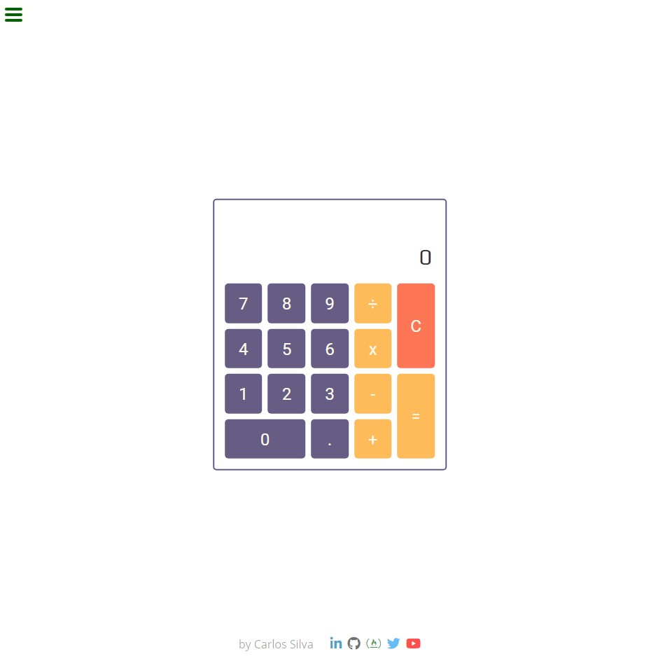
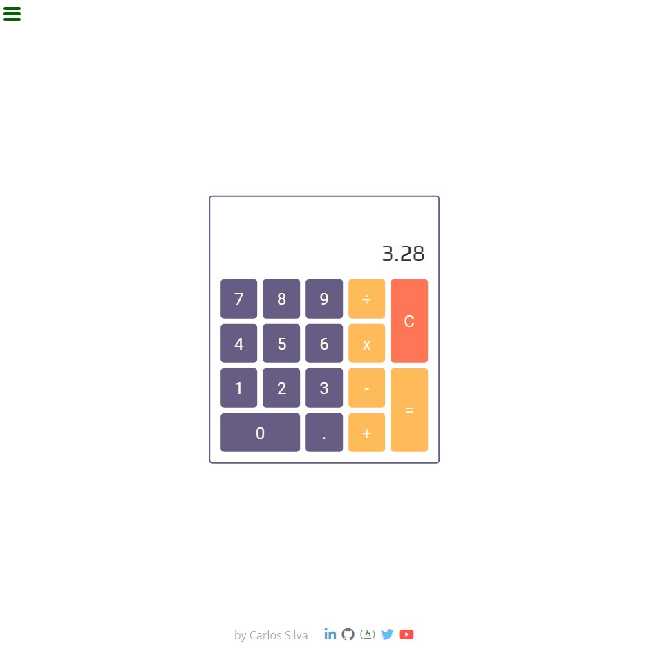

# FreeCodeCamp - JavaScript Calculator
This is part of Free Code Camp curriculum, Front End Libraries section - Build a Build a JavaScript Calculator.

You can see the project page in [freeCodeCamp](https://learn.freecodecamp.org/front-end-libraries/front-end-libraries-projects/build-a-javascript-calculator/),
also you can view it in [codepen](https://codepen.io/xinthauro/full/xBRBGe).

## Screenshots

